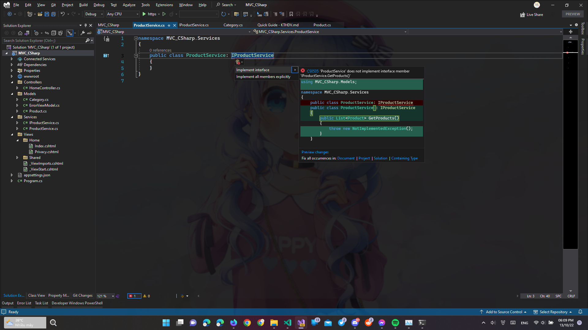
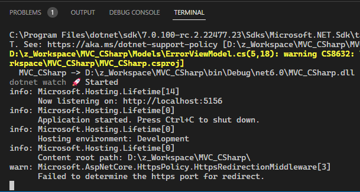

# Quick guide for my SOA learning project

# Demo
[media/2022-10-13%2021-50-22.mp4](media/2022-10-13%2021-50-22.mp4)

# Công cụ cần có
- [VS Code](https://code.visualstudio.com/) (thêm extension [C#](https://marketplace.visualstudio.com/items?itemName=ms-dotnettools.csharp))
- [.NET SDK 6](https://dotnet.microsoft.com/en-us/download/dotnet/6.0)
- SQL ([SQL Server](https://www.microsoft.com/en-us/sql-server/sql-server-downloads), [MySQL](https://dev.mysql.com/downloads/),...)

# Project này sẽ tạo những model gì?
- Sản phẩm (Product): Id, Name, Slug, Price, Quantity, CategoryId
- Danh mục (Category): Id, Name, List<Product>

# MVC trong .NET (Web)

## Tạo project mới

- Tạo một thư mục mới.

- cd đến thư mục vừa tạo và đánh lệnh sau để tạo một project mvc:

```shell
dotnet new mvc
```

- Mở thư mục vừa tạo trong VS Code. Để mở nhanh, đánh lệnh này trong terminal:
```shell
code .
```

## Thêm thư viện vào project
- Tại thư mục của project, thêm các thư viện sau:  
  - Microsoft.EntityFrameworkCore
  - Microsoft.EntityFrameworkCore.Design
  - Microsoft.EntityFrameworkCore.SqlServer (nếu xài SqlServer)
  - Pomelo.EntityFrameworkCore.MySql (nếu xài MySQL)

- Sử dụng lệnh này để thêm
```shell
dotnet add package [tên gói ở trên]
```

## Tạo view Product
- Tại thư mục Project -> Controllers, tạo một file có tên là ProductController.cs, sau khi tạo sẽ như thế này:
```csharp
using Microsoft.AspNetCore.Mvc;

namespace MVC_CSharp.Controllers
{
    public class ProductController
    {

    }
}
```

- Implement Controller vào ProductController: `public class ProductController: Controller`.
- Tạo một hàm Index() và return View() cho nó:
```csharp
public ActionResult Index()
{
    return View();
}
```

- Tại thư mục Project -> Views, tạo một folder có tên Product. Trong folder vừa được tạo, tạo một file có tên Index.cshtml. Copy hết ở Index.cshtml của Home sang:
```csharp
@{
    ViewData["Title"] = "Product";
}

<div class="text-center">
    <h1 class="display-4">Welcome</h1>
    <p>Learn about <a href="https://docs.microsoft.com/aspnet/core">building Web apps with ASP.NET Core</a>.</p>
</div>
```

- Chạy project với url /Product để xem thành quả (vd: https://localhost:7006/Product/). Chi tiết về chạy project xem [tại đây](#launch-project).

## Connection String

Để làm việc với database cần có connection string. Để khai báo connection string cho MVC:
- Mở file appsettings.json.
- Thêm dòng sau (lưu ý sửa connection string phù hợp với database ở trên máy):
  - Với SqlServer:
```json
"ConnectionStrings": {
  "Default": "Server=localhost;Database=ProductDb11;Trusted_Connection=True;"
}
```
  - Đối với MySQL:
```json
"ConnectionStrings": {
  "Default": "server=localhost;database=ProductDb11;user=user;password=password;"
}
```
- Kết quả sau khi thêm:
```json
{
  "Logging": {
    "LogLevel": {
      "Default": "Information",
      "Microsoft.AspNetCore": "Warning"
    }
  },
  "AllowedHosts": "*",
  "ConnectionStrings": {
    "Default": "Server=(LocalDB)\\KTHDV_19Nh14;database=MVCDB;Trusted_Connection=True;"
  }
}
```

- Tại thư mục Project, mở file Program.cs, add dòng này vào (lưu ý phải add trước dòng `var app = builder.Build();`):
```csharp
var connectionString = builder.Configuration.GetConnectionString("Default");
```

- Cũng trong file này, add dòng dưới đây để sử dụng SqlServer:
```csharp
builder.Services.AddDbContext<DataContext>(options => options.UseSqlServer(connectionString));
```

- Cũng như vậy nhưng nếu sử dụng MySQL:
```csharp
var serverVersion = new MySqlServerVersion(new Version(8, 0, 29));
builder.Services.AddDbContext<DataContext>(
    dbContextOptions => dbContextOptions
        .UseMySql(connectionString, serverVersion)
        .LogTo(Console.WriteLine, LogLevel.Information)
        .EnableSensitiveDataLogging()
        .EnableDetailedErrors()
);
```

- Chạy project để xem thành quả (vd: https://localhost:7006/). Chi tiết về chạy project xem [tại đây](#launch-project).

## Tạo model

### Tạo model Products

- Tại thư mục Project -> Models, tạo một file có tên Product.cs, add code sau:
```csharp
using System.ComponentModel.DataAnnotations;

namespace MVC_CSharp.Models
{
    public class Product
    {
        [Key]
        public int Id { get; set; }

        [MaxLength(256)]
        public string Name { get; set; }

        [MaxLength(256)]
        public string Slug { get; set; }

        public int Price { get; set; }

        public int Quantity { get; set; }

        public int CategoryId { get; set; }
    }
}
```
- Trong đó:
  - [Key]: Khóa chính.
  - [MaxLength(256)]: Chỉ định tối đa 256 ký tự.

- Cập nhật database. Để cập nhật, xem ở [đây](#database-migration).

### Tạo model Category

- Tại thư mục Project -> Models, tạo một file có tên Category.cs, add code sau:
```csharp
using System.ComponentModel.DataAnnotations;
 
namespace MVC_CSharp.Models
{
    public class Category
    {
        [Key]
        public int Id { get; set; }
 
        [MaxLength(256)]
        public string Name { get; set; }
 
        public List<Product> Products { get; set; }
    }
}
```

- Cập nhật file Product.cs (để có thể liên kết bảng - phần sau sẽ nói) trong cùng thư mục bằng cách thêm đoạn code này trong class Product:
```csharp
public Category Category { get; set; }
```

- Cập nhật database. Để cập nhật, xem ở [đây](#database-migration).

## Product Services

### Tạo IProductService (interface)
- Tại thư mục Project -> Services (tạo nếu chưa có), tạo một file có tên IProductService.cs, add đoạn code sau:
```csharp
using MVC_CSharp.Models;

namespace MVC_CSharp.Services
{
    public interface IProductService
    {
        List<Product> GetProducts();
    }
}
```

### Tạo ProductService (phần chính của ứng dụng)
- Tại thư mục Project -> Services (tạo nếu chưa có), tạo một file có tên ProductService.cs, sau khi tạo sẽ như thế này:
```csharp
namespace MVC_CSharp.Services
{
    public class ProductService
    {
    }
}
```

- Implement IProductService vào ProductService: `public class ProductService: IProductService`.
- Lúc này nó sẽ báo đỏ ở IProductService do không có hàm để override lại cái interface của nó, chỉ việc CTRL + . tại gạch đỏ và chọn Implement Interface.



- Tại thư mục Project mở file Program.cs để thêm dòng này để Inject (lưu ý phải add trước dòng `var app = builder.Build();`):
```csharp
builder.Services.AddTransient<IProductService, ProductService>();
```
- Để hiểu hơn về builder.Services.AddTransient, xem [tại đây](https://tedu.com.vn/lap-trinh-aspnet-core/vong-doi-cua-dependency-injection-transient-singleton-va-scoped-257.html).

### Tạo DataContext
- Tại thư mục Project -> Model, tạo một file có tên DataContext.cs, sau khi tạo sẽ như thế này:
```csharp
namespace MVC_CSharp.Models
{
    public class DataContext
    {
    }
}
```

- Implement DbContext vào class DataContext: `public class DataContext: DbContext`.
- Add code dưới đây vào class DataContext:
```csharp
public DataContext(DbContextOptions<DataContext> options) : base(options) { }
public DbSet<Product> Products { get; set; }
public DbSet<Category> Categories { get; set; }

protected override void OnModelCreating(ModelBuilder modelBuilder)
{
    modelBuilder.Entity<Product>()
        .HasOne(p => p.Category)
        .WithMany(c => c.Products)
        .HasForeignKey(p => p.CategoryId);

    base.OnModelCreating(modelBuilder);
}
```
- Trong đó:
  - Dòng 2 sẽ khai báo DbSet của Product.
  - Dòng 3 sẽ khai báo DbSet của Category.
  - Dòng 10: `modelBuilder.Entity<Product>()` sẽ tương ứng với việc liên kết bảng Category với bảng Products với khóa ở Products là CategoryId.

### Thêm DataContext vào ProductService
- Mở lại file ở (thư mục project) -> Services -> ProductService.cs, add code sau:
```csharp
private readonly DataContext _context;
public ProductService(DataContext context)
{
    _context = context;
}
```

- Ở hàm GetProducts(), sửa lại thành như thế này để đúng mục đích của nó:
```csharp
return _context.Products.ToList();
```

### Sửa lại ProductController để lấy dữ liệu
- Khai báo ProductService:
```csharp
private readonly IProductService _productService;

public ProductController(IProductService productService)
{
    _productService = productService;
}
```

- Sửa lại hàm Index() (tương ứng với trang Index) để lấy dữ liệu:
```csharp
public IActionResult Index()
{
    var products = _productService.GetProducts();
    return View(products);
}
```

- Trong thư mục Project -> Views -> Product, mở lại file Index.cshtml và thay hết thành code sau:
```csharp
@model List<Product>
@{
    ViewData["Title"] = "Product Page";
    var products = Model;
}
@using MVC_CSharp.Models;

<div class="text-center">
    <h1 class="display-4">Welcome to Product page</h1>

    <table class="table">
        <thead>
            <th>Id</th>
            <th>Name</th>
            <th>Price</th>
            <th>Quantiny</th>
            <th>Category</th>
        </thead>
        <tbody>
            @foreach (var product in products)
            {
                <tr>
                    <td>@product.Id</td>
                    <td>@product.Name</td>
                    <td>@product.Price</td>
                    <td>@product.Quantity</td>
                    <td>@product.Category.Name</td>
                </tr>
            }
        </tbody>
    </table>
</div>
```
- Trong đó:
  - Line 1: Khai báo kiểu dữ liệu.
  - Line 3: Khai báo tiêu đề trang.
  - Line 4: Khai báo biến để lấy dữ liệu.
  - Line 6: using để biết Product ở dòng 1.
  - Các câu lệnh sẽ nằm ở dấu @.

- Tips:
  - Có thể có nhiều dữ liệu được truyền vào. Có thể tham khảo [tại đây](https://www.c-sharpcorner.com/UploadFile/ff2f08/multiple-models-in-single-view-in-mvc/).
  - Để rõ hơn về file cshtml, xem [ở đây](#cau-truc-file-cshtml).

- Chạy project với url /Product để xem thành quả (vd: https://localhost:7006/Product/). Chi tiết về chạy project xem [tại đây](#launch-project).

### Tạo tính năng Thêm (Create)
- Tại thư mục Project -> Views -> Product, mở file Index.cshtml, thêm một thẻ `<th>` trong `<thead>`:
```html
...
<thead>
    <th>Id</th>
    <th>Name</th>
    <th>Price</th>
    <th>Quantiny</th>
    <th>Category</th>
    <th>
        <a href="/Product/Create" class="btn btn-primary">Create</a>
    </th>
</thead>
...
```

- Cũng tại thư mục này, tạo thêm một file có tên Create.cshtml, add code sau:
```csharp
@model List<Category>
@{
    ViewData["Title"] = "Create";
    var categories = Model;
}
@using MVC_CSharp.Models;

<h1 class="display-4">Product Creation page</h1>
<form action="/Product/Save">
    <div class="form-group">
        <label for="Name">Name</label>
        <input type="text" class="form-control" id="Name" name="Name">
    </div>
    <div class="form-group">
        <label for="Name">Slug</label>
        <input type="text" class="form-control" id="Slug" name="Slug">
    </div>
    <div class="form-group">
        <label for="Name">Quantity</label>
        <input type="text" class="form-control" id="Quantity" name="Quantity">
    </div>
    <div class="form-group">
        <label for="Name">Price</label>
        <input type="text" class="form-control" id="Price" name="Price">
    </div>
    <div class="form-group">
        <label for="CategoryId">Category</label>
        <select class="form-control" id="CategoryId" name="CategoryId">
            @foreach (var category in categories)
            {
                <option value="@category.Id">@category.Name</option>
            }
        </select>
    </div>
    <button type="submit" class="btn btn-pirimary">Submit</button>
</form>
```

- Tips:
  - Để rõ hơn về file cshtml, xem [ở đây](#cau-truc-file-cshtml).

- Tại thư mục Project -> Services, mở file IProductService.cs, add các hàm này vào:
```csharp
List<Category> GetCategories();
Product? GetProductById(int id);
void CreateProduct(Product value);
```

- Cũng tại thư mục trên, mở ProductService.cs, implement các hàm trong interface bằng các hàm này:
```csharp
// Lấy tất cả dữ liệu từ bảng Categories
public List<Category> GetCategories()
{
    return _context.Categories.ToList();
}

// Lấy tất cả dữ liệu từ bảng Products
public List<Product> GetProducts()
{
    return _context.Products.ToList();
}

// Thêm Product vào bảng Products
public void CreateProduct(Product value)
{
    _context.Products.Add(value);
    _context.SaveChanges();
}

// Lấy Product bằng Id (có thể Null)
public Product? GetProductById(int id)
{
    return _context.Products.FirstOrDefault(p => p.Id == id);
}
```

- Cũng file trên, sửa hàm GetProducts() thành như thế này (để nó tự include category vào):
```csharp
public List<Product> GetProducts()
{
    return _context.Products.Include(p => p.Category).ToList();
}
```

- Tại thư mục của Project -> Controllers, mở file ProductController.cs, add hàm này:
```csharp
public IActionResult Create()
{
    var categories = _productService.GetCategories();
    return View(categories);
}
```

- Như dòng 9 của code Create.cshtml có nhắc đến /Product/Save, có nghĩa là cũng ở trong file ProductController.cs, tạo thêm hàm này:
```csharp
public IActionResult Save(Product value)
{
    var product = _productService.GetProductById(value.Id);
    if (product == null)
        _productService.CreateProduct(value);
    return RedirectToAction("Index");
}
```

- Chạy project với url /Product để xem thành quả (vd: https://localhost:7006/Product/). Chi tiết về chạy project xem [tại đây](#launch-project).

### Tạo tính năng cập nhật (Update) và xóa (Delete)

- Tại thư mục Project -> Views -> Product, mở lại file Index.cshtml, thêm dòng này dưới @product.Category.Name:
```csharp
...
    <td>@product.Price</td>
    <td>@product.Quantity</td>
    <td>@product.Category.Name</td>
    <td>
        <a href="/Product/Update?id=@product.Id" class="btn btn-success">Update</a>
        <a href="/Product/Delete?id=@product.Id" class="btn btn-danger">Delete</a>
    </td>
</tr>
...
```

- Tại thư mục Project -> Services, mở file IProductService.cs, add các hàm này vào:
```csharp
void UpdateProduct(Product value);
void DeleteProduct(int id);
```

- Cũng tại thư mục trên, mở ProductService.cs, implement các hàm trong interface bằng các hàm này:
```csharp
public void DeleteProduct(int id)
{
    var value = GetProductById(id);
    if (value != null)
    {
        _context.Products.Remove(value);
        _context.SaveChanges();
    }
    return;
}

public void UpdateProduct(Product value)
{
    var value1 = GetProductById(value.Id);
    if (value1 != null)
    {
        value1.Name = value.Name;
        value1.Slug = value.Slug;
        value1.Quantity = value.Quantity;
        value1.Price = value.Price;
        value1.CategoryId = value.CategoryId;
        _context.Products.Update(value1);
        _context.SaveChanges();
    }
    return;
}
```

- Tại thư mục của Project -> Controllers, mở file ProductController.cs, add hàm này:
```csharp
public IActionResult Update(int id)
{
    var product = _productService.GetProductById(id);
    if (product == null) return NotFound();
    ViewBag.Product = product;
    var categories = _productService.GetCategories();
    return View(categories);
}

public IActionResult Delete(int id)
{
    _productService.DeleteProduct(id);
    return RedirectToAction("Index");
}
```

- Cũng tại file này, vì có tính năng update nên hàm Save sẽ xung đột với tính năng create, vì vậy hàm nên sửa thành như thế này:
```csharp
public IActionResult Save(Product value)
{
    var product = _productService.GetProductById(value.Id);
    if (product == null)
    // Nếu null thì không có => Tạo mới
        _productService.CreateProduct(value);
    else
    // Nếu tồn tại => Sửa giá trị
        _productService.UpdateProduct(value);
    return RedirectToAction("Index");
}
```

- Vì tính năng update cần có View nên tại thư mục của Project -> Views -> Product, tạo file Update.cshtml và add code này:
```csharp
@model List<Category>
@{
    ViewData["Title"] = "Update";
    var categories = Model;
    var product = ViewBag.Product;
}
@using MVC_CS.Models;

<h1 class="display-4">Product Update page</h1>
<form action="/Product/Save">
    <div class="form-group">
        <label for="Id">Id</label>
        <input type="text" class="form-control" id="Id" name="Id" readonly="readonly" value="@product.Id">
    </div>
    <div class="form-group">
        <label for="Name">Name</label>
        <input type="text" class="form-control" id="Name" name="Name" value="@product.Name">
    </div>
    <div class="form-group">
        <label for="Name">Slug</label>
        <input type="text" class="form-control" id="Slug" name="Slug" value="@product.Slug">
    </div>
    <div class="form-group">
        <label for="Name">Quantity</label>
        <input type="text" class="form-control" id="Quantity" name="Quantity" value="@product.Quantity">
    </div>
    <div class="form-group">
        <label for="Name">Price</label>
        <input type="text" class="form-control" id="Price" name="Price" value="@product.Price">
    </div>
    <div class="form-group">
        <label for="CategoryId">Category</label>
        <select class="form-control" id="CategoryId" name="CategoryId">
            @foreach (var category in categories)
            {
                if (category.Id == product.CategoryId)
                {
                    <option value="@category.Id" selected="selected">@category.Name</option>
                }
                else
                {
                    <option value="@category.Id">@category.Name</option>
                }
            }
        </select>
    </div>
    <button type="submit" class="btn btn-pirimary">Submit</button>
</form>
```

- Chạy project với url /Product để xem thành quả (vd: https://localhost:7006/Product/). Chi tiết về chạy project xem [tại đây](#launch-project).

### Xong

Đến đây đã tạo xong MVC cơ bản sử dụng SQL.

# Các công cụ khác

## Launch project
- Mở terminal, cd đến thư mục project rồi gõ `dotnet watch`.
- Nếu thành công, địa chỉ sẽ xuất hiện trong terminal.



- CTRL + C trong terminal để tắt chương trình.

## Cấu trúc file cshtml
- Xem [tại đây](https://learn.microsoft.com/en-us/aspnet/core/mvc/views/layout?view=aspnetcore-6.0).

## Database migration

### Tải về
```shell
dotnet tool install --global dotnet-ef
```

### Kiểm tra thay đổi trong database với code
```shell
dotnet-ef migrations add [tên của migration này]
```
- Ví dụ: `dotnet-ef migrations add InitialDb`

### Lưu lại thay đổi
```shell
dotnet-ef database update
```
